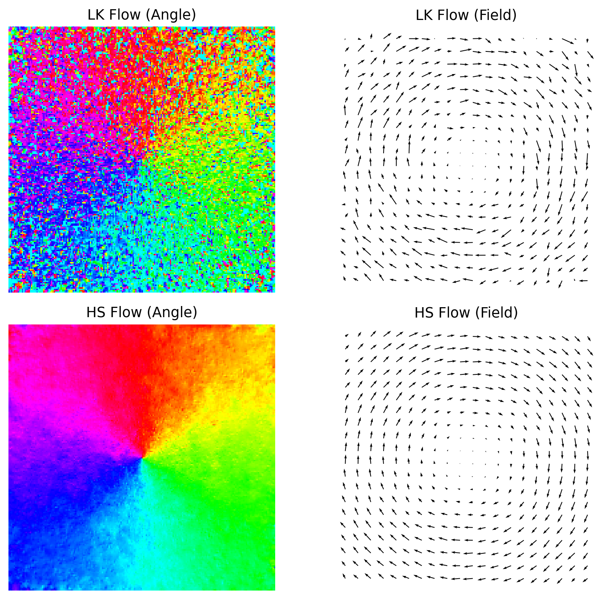
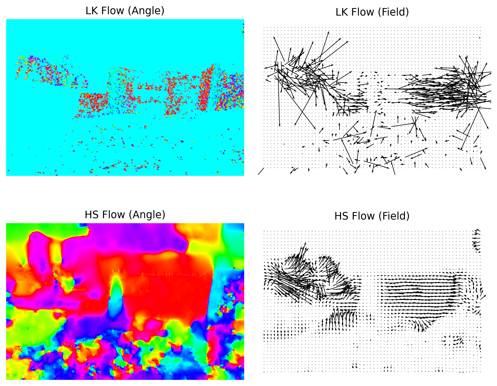

# Optical Flow: Lucas-Kanade and Horn-Schunck

This was the first assignment for Advanced Computer Vision Methods. I implemented dense optical flow with Lucas-Kanade and Horn-Schunck, tested both methods on synthetic and real image pairs, and compared their speed/accuracy tradeoffs.

## What I did

- Implemented Lucas-Kanade optical flow with local least squares.
- Implemented Horn-Schunck optical flow with iterative smoothness regularization.
- Used Gaussian derivatives for image gradients.
- Compared both methods on synthetic rotation and real stereo/disparity examples.
- Tested parameter effects for LK window size, HS regularization, and iteration count.
- Added an extra pyramidal Lucas-Kanade experiment for larger motion.

## Results

| Experiment | Result |
| --- | --- |
| Best LK setup | window size `N=5`, residual `1.1170e-2`, 18.56 ms |
| HS example | `lambda=0.5`, 1000 iterations, residual `1.0373e-2`, 817.55 ms |
| Best HS sweep | `lambda=0.1`, 1000 iterations, residual `8.2025e-3` |
| LK-initialized HS | residual `1.0492e-2`, 291.77 ms |

Horn-Schunck produced smoother dense flow and lower residuals, while Lucas-Kanade was much faster. Initializing HS with LK was a useful compromise because it reduced runtime with only a small loss in residual.

The pyramidal LK part worked as an implementation experiment, but the report notes that the current pyramid settings still need tuning.

## Example figures

Synthetic optical flow example:



Real image pair from the report:



## Files

```text
of_methods.py             # Lucas-Kanade, Horn-Schunck, and pyramid-related code
run_assignment1.py        # Main experiment runner
temp_make_report_figs.py  # Figure generation script
main.tex                  # Report source
report_temp_figs/         # Generated report figures
Figure_*.png              # Additional generated figures
```

## How to run

```bash
python run_assignment1.py
```

The original image sequences are not included in the repository version. They should be placed locally in the same structure as used in the assignment folder.

## Tools

- Python
- NumPy
- OpenCV / image processing utilities
- Matplotlib
- LaTeX
